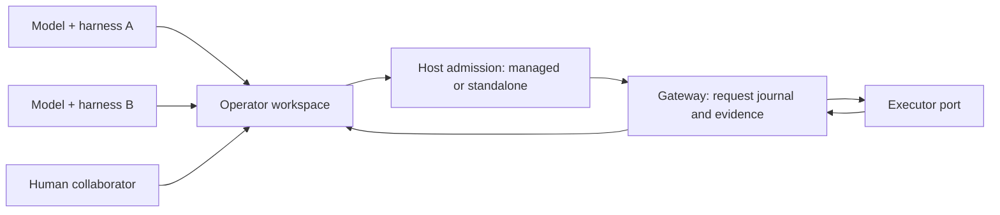

# MADP for OP

### Different harnesses. Shared workspaces. Verifiable operator iterations.

[中文](README.zh-CN.md) · [Run the demo](docs/guides/FILE_COLLABORATION_DEMO.md) · [Architecture](docs/architecture/FILE_FIRST_COLLABORATION.md) · [Evidence & limits](docs/showcase/EVIDENCE.md) · [Interleaved development](docs/showcase/INTERLEAVED_OPERATOR_DEVELOPMENT.md)

MADP is a **file-first collaboration and execution core for operator engineering**.
It treats a model together with its harness—the tools, session and runtime around
it—as an independent participant. Participants keep their native environment
while sharing source, experiment notes, test requests and durable results.

**The unit of collaboration is the workspace, not a shared chat or a required
agent SDK.** MADP does not supply intelligence or replace coding agents. It
provides the coordination and evidence boundary around their work.

> Latest published: [V5 Iteration Runtime, 5.6.0a1](https://github.com/LoonyReina/MADP-for-OP/tree/preview-2026-09-13-v5-iteration-runtime).
> This branch prepares **File-first Collaboration, 5.6.1a1**; it is not yet published.
> This is a public core preview, not the complete private AscendOP deployment.

## Why this exists

Operator development has two expensive loops: making results correct and making
correct results fast. A useful hypothesis may come from another model, another
terminal tool, or a human inspecting a device trace. That work should not lose
its source lineage or test evidence when the participant changes.

- **Can another participant continue?** Keep the candidate, cases, stage,
  baseline and next experiment in the operator workspace.
- **Did the experiment actually run?** Keep accepted requests, original results
  and acknowledgements separate from conversation summaries.
- **Can the researcher change direction?** Participants choose experiments,
  legal case revisions and submit/hold; the framework executes and validates
  requested work within configured authority.

## How the pieces fit



Only one admitted writer owns a candidate at a time; different operator
workspaces can progress independently. Managed scheduling uses the daemon.
Standalone hosts may drive the same Gateway lifecycle without requiring the
daemon to message their harness. An external evaluator is a separate adapter,
not implied by a local PASS. [Collaboration model](docs/architecture/FILE_FIRST_COLLABORATION.md).

## Try a real boundary with a small synthetic experiment

Use Python **3.11+** in a dedicated virtual environment. No model key, GPU/NPU,
remote endpoint or browser account is needed.

```bash
python -m venv .venv
# Activate .venv with the command for your shell, then:
python -m pip install ./packages/ascendop_protocol ./packages/ascendop_control ./packages/ascendop_agent_runner ./packages/ascendop_daemon ./packages/ascendop_test_gateway
python scripts/demo_file_collaboration.py --root artifacts/file-demo-01
```

Two fixture processes exchange files: the first produces a failing toy candidate;
the second reads the result and repairs it. The **real public Gateway** retains
both results. A fresh Gateway object recovers accepted evidence without
resubmitting; ACK is delivered separately. External submission stays on HOLD.

Expected: `failed (1/3) → completed (3/3)`, two delivered ACKs, zero model/device/
external calls. This tests protocol mechanics, **not live multi-model reasoning**.
Use a new output directory for each run. [Walkthrough](docs/guides/FILE_COLLABORATION_DEMO.md).

## Public packages

| Package | Responsibility |
| --- | --- |
| `ascendop-protocol` | Typed action, evidence, actor and wire contracts. |
| `ascendop-control` | Durable actions, leases, completion transactions and outbox. |
| `ascendop-agent-runner` | Provider ports, workspace isolation and process/turn lifecycle. |
| `ascendop-tester-daemon` | Managed scheduling, file-client handoff and short notifications. |
| `ascendop-test-gateway` | Standalone test lifecycle, retained results, recovery and ACK. |

The historical `ascendop_*` names remain for compatibility. Concrete GP relay /
Engine deployment, hardware runners, operator sources/cases, account automation
and live configuration are **not included**. Real deployments supply trusted
domain adapters; the demo supplies toy ports.

Some exported policy classes retain earlier automation semantics. The latest
agent-owned research strategy is documented separately; this is **not a claim
that every legacy runtime gate has been migrated**.
[Capability boundary](docs/architecture/FILE_FIRST_COLLABORATION.md#implementation-boundary).

## Evidence, not just a diagram

- Published release B passed **332 source + 332 installed-wheel tests** across
  five packages in a dedicated Windows environment, with zero live model or
  hardware calls. [Provenance](release/v5-iteration-runtime/PROVENANCE.json).
- The next edition adds file handoff, prompt and long-path artifact regressions.
  [Candidate qualification](release/file-first-collaboration/README.md).
- Private AscendOP collaboration involving Codex, Kimi and DSH informed the design,
  including manual coordination and recovery. This is **experience, not public
  end-to-end adapter certification or a controlled benchmark**.
  [Lessons and limits](docs/showcase/EVIDENCE.md).

The showcase now documents a **vertical interleave** between broad case search,
correctness diagnosis, performance experiments and independent handoff. A small
Markov model makes the escape-from-local-optimum hypothesis explicit without
presenting toy probabilities as benchmark data. See [interleaved
development](docs/showcase/INTERLEAVED_OPERATOR_DEVELOPMENT.md) and the
[sanitized collaboration record](docs/showcase/COLLABORATION_RECORD_KIMI_DSHARNESS_CODEX.md).

## Explore and contribute

- [Value and differentiation](docs/showcase/PROJECT_POSITIONING.md)
- [Cross-agent wiki plan](docs/showcase/CROSS_AGENT_WIKI.md)
- [Codex for Open Source application draft](docs/showcase/CODEX_FOR_OPEN_SOURCE_APPLICATION.md)
- [Participant handoff](docs/guides/PARTICIPANT_HANDOFF.md)
- [Performance strategy](docs/guides/PERFORMANCE_ITERATION.md)
- [Roadmap](docs/showcase/ROADMAP.md) and [contributing](CONTRIBUTING.md)
- [Publication boundary](docs/architecture/PUBLICATION_MODEL.md) and [history](HISTORY.md)

Apache-2.0. See [LICENSE](LICENSE). Mentioning model/tool providers implies no
affiliation or endorsement.
